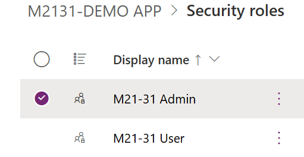
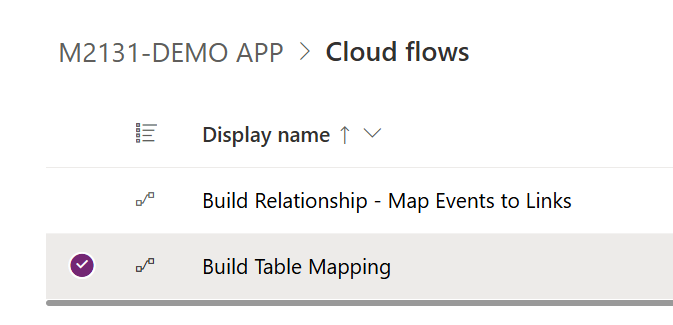
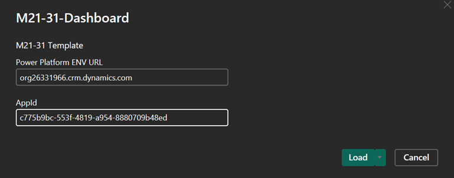

# Implementation Guide Overview
- Solution is used to assist with tracking implementation of M21-31 Event Logging requirements. Solution is supported for all cloud types (Commercial, GCC, GCCH, and DOD)
---
# Required Items:
- [PowerBI Template File](PowerPlatform/PowerBI/M21-31-Dashboard.pbit)
- [Ingest File](PowerPlatform/Data/M2131v0.1.0-BETA.xlsx)
- [Power App Solution File](PowerPlatform/PowerApps/M2131DEMOAPP_1_0_0_26.Zip)
## Pre-Reqs:
1. Ensure that the Dataverse environment is correctly set up and accessible.
2. Verify the security roles to ensure appropriate permissions for importing the solution.
3. Power App Per User License for each user.
3. Power BI Workspace to publish PBIX too.
4. Power BI Desktop App
---
## Power App (Part 1)
### Import Power Apps Solution
- Navigate to Power Apps desired environment where the solution will be imported.
- Go to “Solutions” and click on “Import Solution.”
- Upload the M2131 Solution Zip file.
### Import Data into Dataverse
1. From the same environment the solution was imported, navigate to Dataflows. This should be the same person who imported the solution.
2. Edit the “M21-31 - Import DataFlow” Dataflow:
- Click on the EL0 Table.
- Click on the Gear next to the Source Step.
- Upload or browse to the location of the `Ingest File` file.
- Configure connection to file.
- Click **Next**.
- Click **Publish**.
---
### Setup Security Roles
- There are two security roles to provide admin and read access to the M2131 Custom Tables.
- Any User needing access to the solution will require membership of one of the 2 roles.
- 
---
### Run Relationship Workflows
- There are two solutions that run to establish data relationships:
1. Navigate to the Solution.
2. Click on Flows.
3. Run both flows once.
- 
---
### Get AppID / ORG URL and Test the App
1. Navigate to the Solution.
2. Click on Apps.
- 
4. Play the M2131 App.
**Note**: When the App opens, the initial PowerBI Report will fail. This is expected until linked.
- Grab the Org URL and APP ID from the URL. See the example below.
- 
---
## Power BI
### Setup PowerBI
1. Open the `M2131-Dashboard-Template.pbit` file in Power BI Desktop.
2. Enter the ORG URL above without the `[URL] no trailing backslash. Using example above: `indencetest.crm9.dynamics.com`.
3. Enter the AppID from the URL retrieved earlier.
- 
5. Click Load.
---
### Publish the File
1. Once Data is loaded, now Publish the file to Power BI Online Workspace:
- Click the **Publish** button.
- Save the file to preferred local destination.
- Choose the Workspace to publish too.
- Click **Select**.
- Click **Got It** on the success screen.
---
## Power APP (Part 2)
### Setup Dashboard
1. Navigate to the Solution imported earlier.
2. Click on Dashboards.
3. Edit the **M21-31 Compliance Management Dashboard**.
4. Update the Workspace and Report for the Published M2131 Report in previous step.
5. Click **Save**.
6. Click **Publish**.
