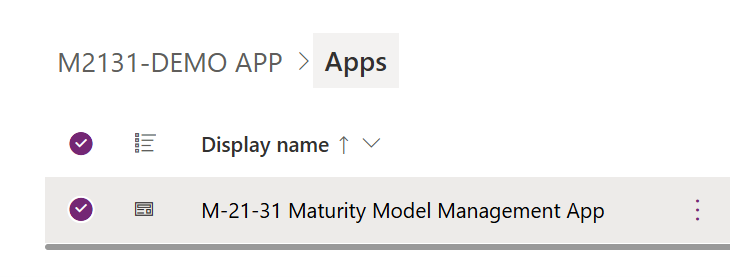

# M-21-31 Implementation Guide Overview

The **M-21-31 Implementation Guide** outlines the steps required to deploy and configure the tools supporting event logging maturity tracking in alignment with **Executive Order M-21-31**. This solution is supported across all cloud environments—**Commercial**, **GCC**, **GCCH**, and **DoD**.

---

## 📦 Required Items

To begin implementation, download and prepare the following components:

- [Power BI Template File](PowerPlatform/PowerBI/M21-31-Dashboard.pbit)  
- [Ingest File (Excel)](PowerPlatform/Data/M2131v0.1.0-BETA.xlsx)  
- [Power App Solution File](PowerPlatform/PowerApps/M2131DEMOAPP_1_0_0_26.zip)  

---

## ⚙️ Pre-Requisites

Before deploying the solution, ensure the following prerequisites are met:

1. A properly configured **Dataverse environment**  
2. Appropriate **security roles** are in place for solution import  
3. Each user has a **Power Apps Per User license**  
4. A **Power BI workspace** is available for publishing the dashboard  
5. **Power BI Desktop** is installed locally  

---

## 🧩 Power App Setup (Part 1)

### 🔄 Import Power Apps Solution

1. Navigate to the desired **Power Apps environment**  
2. Select **“Solutions”** > **“Import Solution”**  
3. Upload the provided `.zip` solution file  

### 📥 Import Data into Dataverse

1. In the same environment, go to **Dataflows**  
2. Edit the “**M21-31 - Import DataFlow**”:  
   - Click on the **EL0 Table**  
   - Select the ⚙️ gear icon next to the **Source** step  
   - Upload or browse to the **Ingest File**  
   - Configure the connection  
   - Click **Next**, then **Publish**  

---

### 🔐 Setup Security Roles

There are two custom **security roles** included with the solution:

- One for **admin access**  
- One for **read-only users**

Any user accessing the solution must be assigned one of these roles.

---

### 🔄 Run Relationship Workflows

To establish table relationships, run the provided cloud flows:

1. Navigate to the imported solution  
2. Click on **Flows**  
3. Run both flows manually once  

---

### 🧪 Get App ID / Org URL and Test the App

1. In the solution, go to **Apps**  
2. Open the **M2131 App**  
3. **Note**: The initial Power BI report inside the app will fail—this is expected until it's linked  
4. Copy the **Org URL** and **App ID** from the URL bar (see below):

  

---

## 📊 Power BI Setup

### 🧷 Configure Power BI Desktop

1. Open the `.pbit` file in **Power BI Desktop**  
2. Input your **Org URL** (no trailing slash).  
   - Example: `indencetest.crm9.dynamics.com`  
3. Paste in the **App ID** retrieved earlier  

4. Click **Load**  

---

### ☁️ Publish to Power BI Service

1. Once data is loaded, click **Publish**  
2. Choose your desired local save location  
3. Select the correct **Power BI Workspace**  
4. Click **Select**, then **Got It** on the confirmation  

---

## 🖥️ Power App (Part 2) – Dashboard Setup

1. Return to the imported **Power Apps Solution**  
2. Go to **Dashboards**  
3. Edit the **M21-31 Compliance Management Dashboard**  
4. Link the dashboard to the **published Power BI report**:  
   - Update both **Workspace** and **Report** references  
5. Click **Save**  
6. Click **Publish**  

---

📫 **Need help or have feedback?**  
Email us at **m2131collective@microsoft.com** for support, collaboration opportunities, or deployment guidance.

---

> ⚠️ **Disclaimer**  
> The **M-21-31 Implementation Guide** and associated solution files are **not official Microsoft products**. They were developed independently by Microsoft employees and partners in their own capacity.  
>  
> This guide is provided for informational and operational support purposes only and does **not guarantee compliance** with Executive Order **M-21-31** or any related federal directive.  
>  
> While the tools assist with configuration tracking and dashboard integration, **actual log validation and event verification must be conducted within Microsoft Sentinel**, using the **Event Verification Workbook** or equivalent forensic tools.

---
